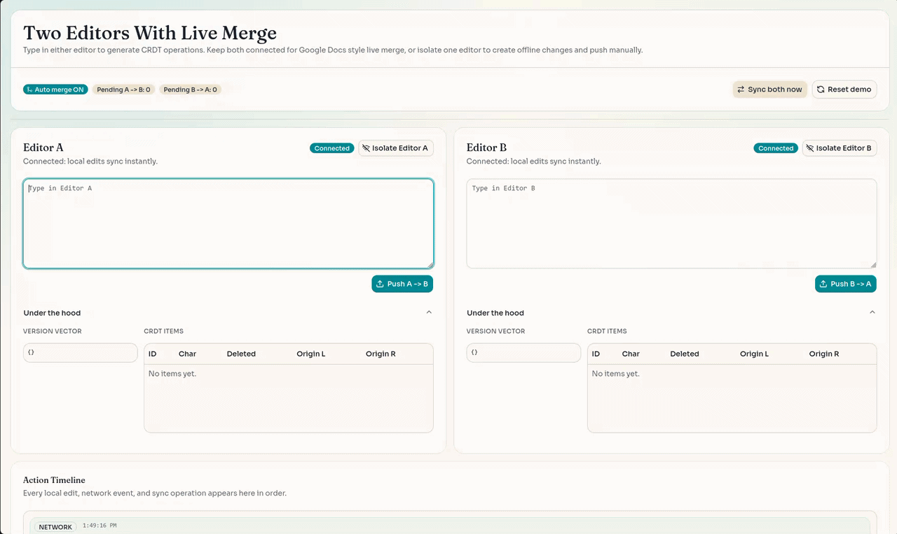

# CRDT Collaborative Editor Playground

A full-stack-less collaborative editing playground built with React, TypeScript, shadcn/ui, and Tailwind CSS.

This project demonstrates how a character-level CRDT can keep two editor replicas consistent while supporting:

- automatic live merge (Google Docs style) when connected
- simulated network partitions (isolate one editor)
- manual one-way sync/push between replicas
- transparent internals (version vector, CRDT item table, action timeline)



## Features

- Two independent editor replicas (`Editor A`, `Editor B`) powered by `CRDTDocument`
- Automatic merge when both replicas are connected
- Per-editor isolate/reconnect controls
- Pending operation counters (`A -> B`, `B -> A`)
- Manual controls:
    - push `A -> B`
    - push `B -> A`
    - two-way sync
    - reset demo
- Under-the-hood panel per editor:
    - version vector
    - ordered CRDT item list with tombstones
- Action timeline with local/network/sync event types

## Tech Stack

- React 19
- TypeScript 6
- Vite 8
- Tailwind CSS v4
- shadcn/ui (Radix Vega style)
- Radix primitives (via `radix-ui` package)
- Lucide icons

## Project Structure

```text
.
├── components.json
├── src
│   ├── App.tsx
│   ├── index.css
│   ├── main.tsx
│   ├── components
│   │   ├── CRDTDemo.tsx
│   │   └── ui
│   │       ├── accordion.tsx
│   │       ├── badge.tsx
│   │       ├── button.tsx
│   │       ├── card.tsx
│   │       ├── scroll-area.tsx
│   │       ├── separator.tsx
│   │       ├── table.tsx
│   │       └── textarea.tsx
│   ├── lib
│   │   └── utils.ts
│   └── utils
│       └── crdt.ts
├── tsconfig.json
├── tsconfig.app.json
├── tsconfig.node.json
└── vite.config.ts
```

## Getting Started

### Prerequisites

- Node.js 20+ (recommended)
- npm (or bun)

### Install dependencies

```bash
npm install
```

### Start development server

```bash
npm run dev
```

Open the local URL shown by Vite.

### Build production bundle

```bash
npm run build
```

### Run lint checks

```bash
npm run lint
```

### Preview production build

```bash
npm run preview
```

## Scripts

| Command           | Description                              |
| ----------------- | ---------------------------------------- |
| `npm run dev`     | Start Vite dev server                    |
| `npm run build`   | Type-check (`tsc -b`) + production build |
| `npm run lint`    | Run ESLint                               |
| `npm run preview` | Preview built app                        |

## shadcn/ui + Tailwind Setup (from scratch)

This repository is already configured, but if you need to reproduce setup in a fresh Vite app, run:

```bash
# 1) Initialize shadcn in a Vite + Radix project
npx shadcn@latest init -t vite -b radix -p vega -y

# 2) Add components used by this demo
npx shadcn@latest add card badge textarea table scroll-area separator accordion
```

Notes:

- Tailwind v4 is loaded in `src/index.css`.
- The `@/*` alias is configured in TS configs and `vite.config.ts`.
- `components.json` defines shadcn aliases and styling mode (`radix-vega`).

## How the Demo Works

1. Both editors start connected.
2. Typing in one editor creates local CRDT operations.
3. If both are connected, operations merge automatically into the peer replica.
4. If one editor is isolated, operations remain local and pending counters increase.
5. Use push/sync controls (or reconnect) to deliver queued changes.

## CRDT Core API

The CRDT engine lives in `src/utils/crdt.ts`.

### Main class

```ts
class CRDTDocument {
    constructor(initialDoc?: Doc);

    static fromDoc(doc: Doc): CRDTDocument;

    getText(): string;
    insert(agent: string, pos: number, text: string): void;
    insertOne(agent: string, pos: number, char: string): void;
    delete(pos: number, length: number): void;

    mergeFrom(source: CRDTDocument | Doc): void;
    applyRemoteInsert(item: Item): void;

    toDoc(): Doc;
    getItems(): Item[];
    getVersion(): Version;
}
```

### Data model

- `ID = [agent, seq]`
- `Item` contains content, unique id, left/right origins, and `deleted` tombstone state
- `Version` tracks the highest sequence applied per agent
- `Doc` contains ordered content items and version map

## CRDT Merge Model (high level)

- Inserts are causal and ordered by:
    - origin references (`originLeft`, `originRight`)
    - deterministic conflict resolution by agent id when origins collide
- Deletes mark tombstones (`deleted = true`) instead of removing items
- Replica merge (`mergeInto`) applies missing operations only when dependencies exist, then propagates delete flags

## Limitations / Scope

- In-memory simulation only (no real server transport layer)
- No cursor-presence or selection synchronization
- Text diffing in the UI assumes a single contiguous change per input event (works well for typical typing/editing)

## Development Notes

- `react-refresh/only-export-components` is disabled for generated `src/components/ui/*` files because shadcn component files export variant constants.
- TypeScript path alias and deprecation settings are configured in `tsconfig.app.json` and `tsconfig.node.json`.

## Validation Checklist

Before committing changes, run:

```bash
npm run lint
npm run build
```
